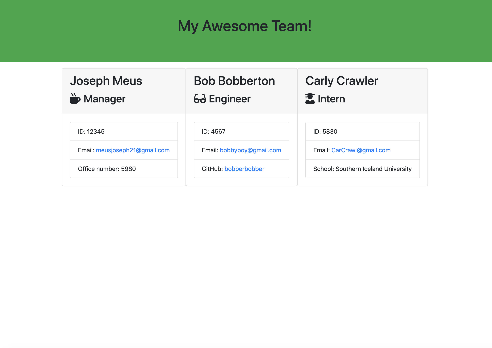

# Team Generator!

  ## Description

  The Team Generator allows a user (owner of a business) to use the command line to enter information about his or her employees including managers, engineers, and interns. They user is able to enter as little or as many employees as he or she would like into the command line. When finished entering all of the required information for the employees, that information will be sent into a formatted HTML file that will build a beautiful webpage that displays the owners employees. The webpage can be updated whenever. This project was really fun to do especially when working with classes for the javascript files. That made the information easily transferrable between javascript files and when all of the sub javascript files were built, building the main file that referenced them was a relatively painless task. I didnt struggle to hard on this assignment and it was rather fun to do! Great knowledge for working with tests and node.js.
  

  ## Table of Contents

  *[installation](#installation)

  *[usage](#usage)

  *[contributing](#contributing)

  *[questions](#questions)

  *[test](#test)

  ## Installation

  To install necessary dependencies, run the following command: undefined

  ## Usage

  undefined

  ## Contributing 
  Joseph Meus

  

  ## Tests 

  To run tests, run the following command:
  npm run tests

  ## Questions 

  If you have any questions, feel free to contact me at meusjoseph21@gmail.com. 

  More of my work can be found at [meusjoseph21](https://github/com/meusjoseph21)

## Screenshots

App Run Through Video: 
https://drive.google.com/file/d/1XKWcRegKjZzOlEg6x8zvgqQZ5x2_dRzK/view

Running Test Video: 
https://drive.google.com/file/d/1VAciCNnrkXvHwchqqs4pQE4vrOS7Adph/view

## Repository

https://github.com/meusjoseph21/teamGenerator-hw